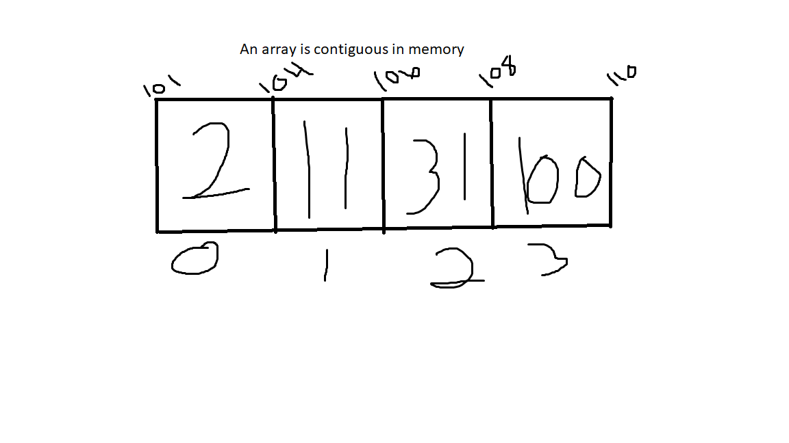

# Array

An Array is linear data structure that stores data in a contiguous way.

# In Memory

In memory, an array looks like this:



The array is contiguous in memory, meaning the data is phyiscally stored next to each other in memory. 

# Operations

An array supports the following operations:

* Access: Returns data by the index specified.  This operation is O(1) because the exact position of the value is known.
* Search/Insertion/ Deletion: Looking through an array to find a value in order to return, or delete, the value. This operation is O(n) because of the number of operations that must be done to check if the current value is the value that is being searched for. If using delete or insertion, all the values to the right must be shifted over one spot.

# Use Cases

An Array is useful when you have data to store and can keep track of the index of each value to provide O(1) access time.

It is not as good as a linked list when it comes to insertion/deletion because in a linked list, there is no shifting of other values.

# Example

```
my_array = []
my_array.append(15)
my_array.append(20)
my_array.append(35)
my_array.index(20)
print(my_array)
```

(c) 2018 Josh Gautney. All rights reserved.
