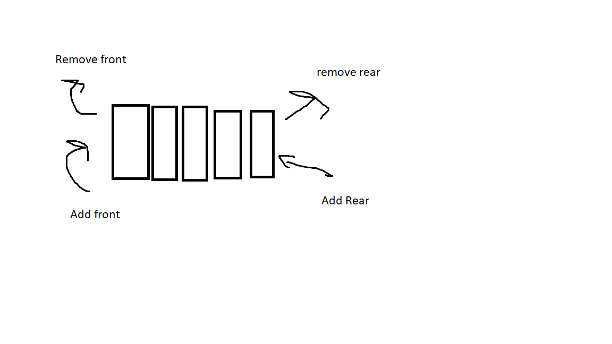

# Deque

A deque, or double ended queue, is similair to a queue except in a deque items can be added and removed from both ends.

# In Memory

In memory, a deque looks like this:



In a deque items can be added and removed from both ends. These operations can only happen on the ends. Items in the middle can not be removed until they reach the end

# Operations

A deque supports the following operations:

* addFront(): Adds a new item to the "front" of the deque.  This is an O(1) operation as a deque keeps track of the front of the deque.
* removeFront(): removes the item in the "front" of the deque. This is an O(1) operation for the same reason as addFront().
* addRear(): Adds an item to the rear of the deque.  This is an O(1) operation becasue the rear of the deque is tracked.
* removeRear(): Removes an item fron the rear of the deque.  This is an O(1) operation for the reason above.

# Use Cases

A deque is useful when you need a list of items in order but can remove and add from both ends.

A deque is not good if you want to maintain order based on what came first.

# Example

```
my_deque = Deque()
my_deque.addRear(1)
my_deque.addFront(55)
my_deque.removeRear()
my_dequ.addRear(100)
```