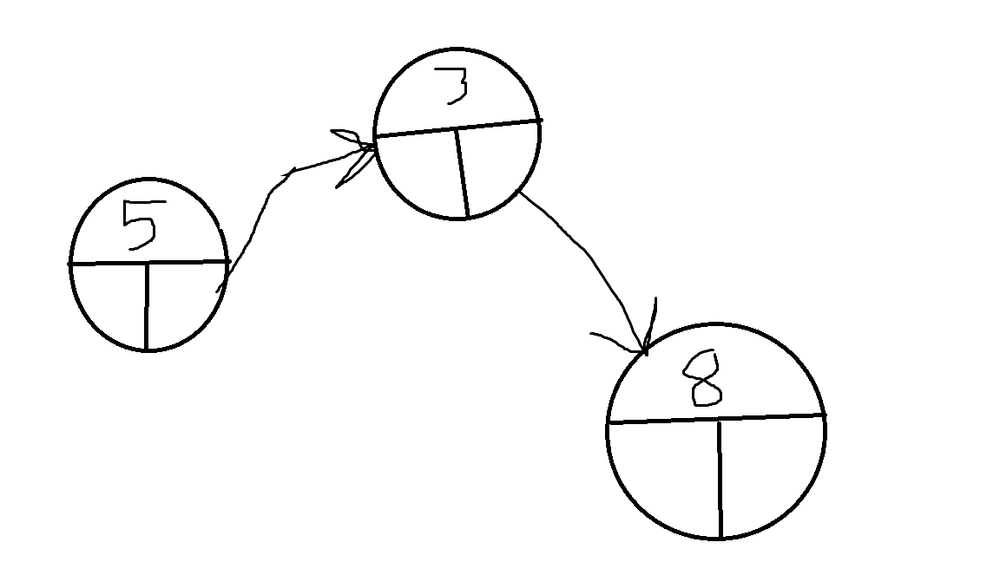

# Linked List

A Linked list is a series of nodes containing a value and a reference to the next node in the list.

# In Memory

In memory, an Linked list looks like this:



Unlike a tuple or array, a linked list is not contigous in memory. Instead each node in a linked list contains a reference to the memory adress of the next node.  In a doubly linked list, each node can also have a reference to the previous node.

# Operations

A linked list supports the following operations:

* Search: Searches through the linked list to find the value. This is O(n) since the list needs to search each node to see if it contains the value needed.
* Append: Addes a new node to the linked list. This operation is O(n) since the list will need to be searched for the last node in the list.  If a doubly linked list is used, this operation becomes O(1) because the first node in the list will reference the last node of the list.
* Insertion/Deletion: Inserts/Deletes a node in the list.  This operation is O(n) since the list needs to be searched to find the spot to insert the new node or the value that needs to be deleted.

# Use Cases

A linked list is useful when the values don't need to be contiguous and, when using a doubly linked list, want to be able to append to the list in O(1) time.

The linked list is not as useful as a Dictionary if you want to access values with O(1) time.

# Example

```
my_list = double_list()
list.append(10)
list.append(14)
list.append(100)
list.remove(14)

```

(c) 2018 Josh Gautney. All rights reserved.
