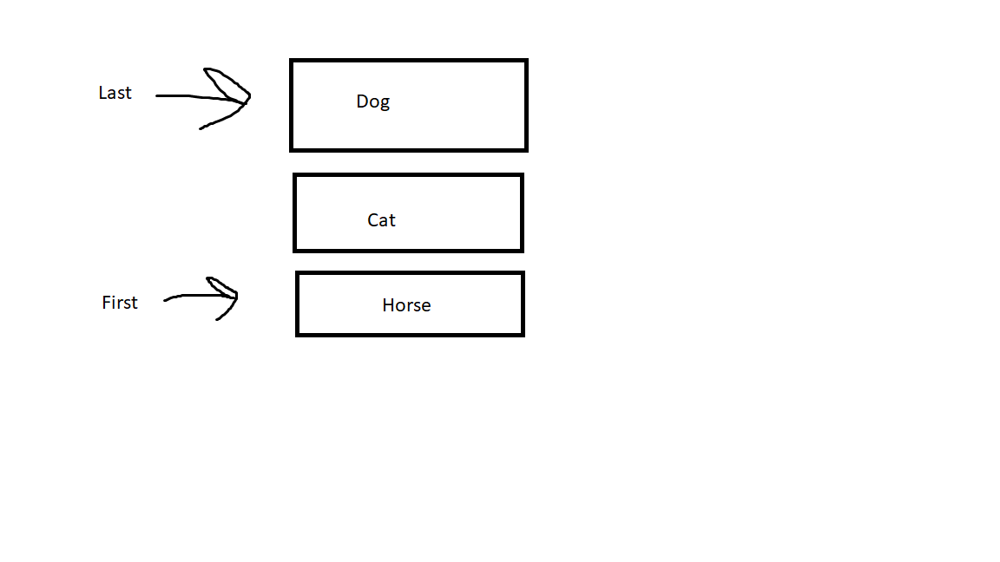

# Stack

A stack is a set of  contiguous data that is Last In, First Out (LIFO).  Which means only the last item added to the stack can be removed.

# In Memory

In memory, a stack looks like this:



A Stack is a contiguous set of values that can only be removed in the reverse oreder they were added.  The first item added is the last item to be removed. 

# Operations

A Stack supports the following operations:

* Push: Adds a new item to the "top" of the stack.  This is an O(1) operation as a stack keeps track of the last item added to the stack.
* Pop: Removes the item on the "top" of the stack. This is also O(1) for the same reason as the push operation.
* Peek: Looks at the top value of the stack with out popping the value.  O(1) operation because the "top" of the stack is tracked.

# Use Cases

A stack is useful if you have data coming in that will be removed in the reverse order with items being added and removed in O(1) time.

A Stack is not useful if you need to access data that is not on "top" of the stack. It would be better to use an array in that situation.

# Example

```
my_stack = Stack()
my_stack.push(10)
my_stack.push(100)
my_stack.push(9)
my_stack.push('bird')
my_stack.pop()
my_stack.peek()
```