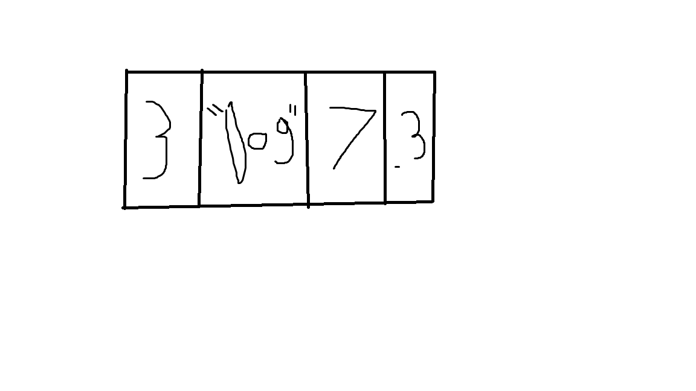

# Tuple

An Tuple is heterogeneous, linear data structure that is immuteable after it has been created.

# In Memory

In memory, an Tuple looks like this:



The tuple is contiguous in memory like an array, meaning the data is phyiscally stored next to each other in memory. 

# Operations

An array supports the following operations:

* Indexing: searches a tuple to see if a value or string is present in the tuple and returns the index if it is.  This is O(1) because the tuple is immutable after creation.
* Slicing: Allows accesing a range of of items in a tuple. This is also O(1) for the same reason as indexing.

# Use Cases

A Tuple is useful if you have a set of data that will not be changing but you will be referencing back to.

The tuple is not as good as an array if you need to make changes to the values such as insertion as deletion since a tuple does not support these operations.

# Example

```
this_tuple = (10, 35, 0.5, "Oregon")
print(this_tuple[0:3])
print(this_tuple[2:3])
```

(c) 2018 Josh Gautney. All rights reserved.
